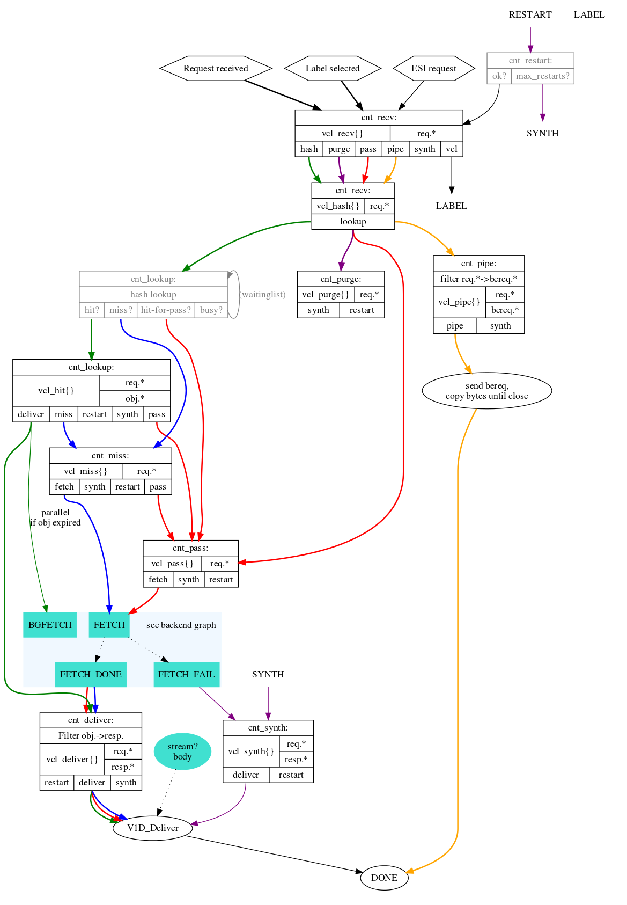

# varnish vcl generator

## Installation

```bash
$ npm install varnish-generator -g
```

## RUN

```bash
varnish-generator -c ./examples/config.json -t ./examples/default.vcl
```

### varnishConfig

- `name` The varnish instance's name

- `stale` The seconds of stale, default is 3

- `directors` Director list, Array

- `directors.name` The director's name

- `directors.prefix` The prefix of the url for the director, optional

- `directors.host` The host for the director, optional

- `directors.type` The algorithm of load balance, it can be 'fallback', 'hash', 'random', 'round_robin'. The default is 'round_robin'

- `directors.backends` The backend list, Array

- `directors.backends.ip` The ip of backend

- `directors.backends.port` The port of backend

- ``directors.backends.weight` The weight of backend, it's used for `random` and `hash`

```json
{
  "name": "varnish-test",
  "stale": 2,
  "directors": [
    {
      "name": "timtam",
      "prefix": "/timtam",
      "director": "fallback",
      "backends": [
        {
          "ip": "127.0.0.1",
          "port": 3000
        },
        {
          "ip": "127.0.0.1",
          "port": 3010
        }
      ]
    },
    {
      "name": "dcharts",
      "prefix": "/dcharts",
      "host": "dcharts.com",
      "director": "hash",
      "hashKey": "req.http.cookie",
      "backends": [
        {
          "ip": "127.0.0.1",
          "port": 3020,
          "weight": 5
        },
        {
          "ip": "127.0.0.1",
          "port": 3030,
          "weight": 3
        }
      ]
    },
    {
      "name": "vicanso",
      "host": "vicanso.com",
      "director": "random",
      "backends": [
        {
          "ip": "127.0.0.1",
          "port": 3040,
          "weight": 10
        },
        {
          "ip": "127.0.0.1",
          "port": 3050,
          "weight": 5
        }
      ]
    },
    {
      "name": "aslant",
      "backends": [
        {
          "ip": "127.0.0.1",
          "port": 8000
        }
      ]
    }
  ]
}
```

## How to use varnish better?

Please read [my advise about using varnish](./use-better-zh.md).

## How the cache of varnish is created?



## How to run

varnishd -f examples/default.vcl -t 0 -p default_grace=1800 -p default_keep=10 -a :8001 -F

## License

MIT
