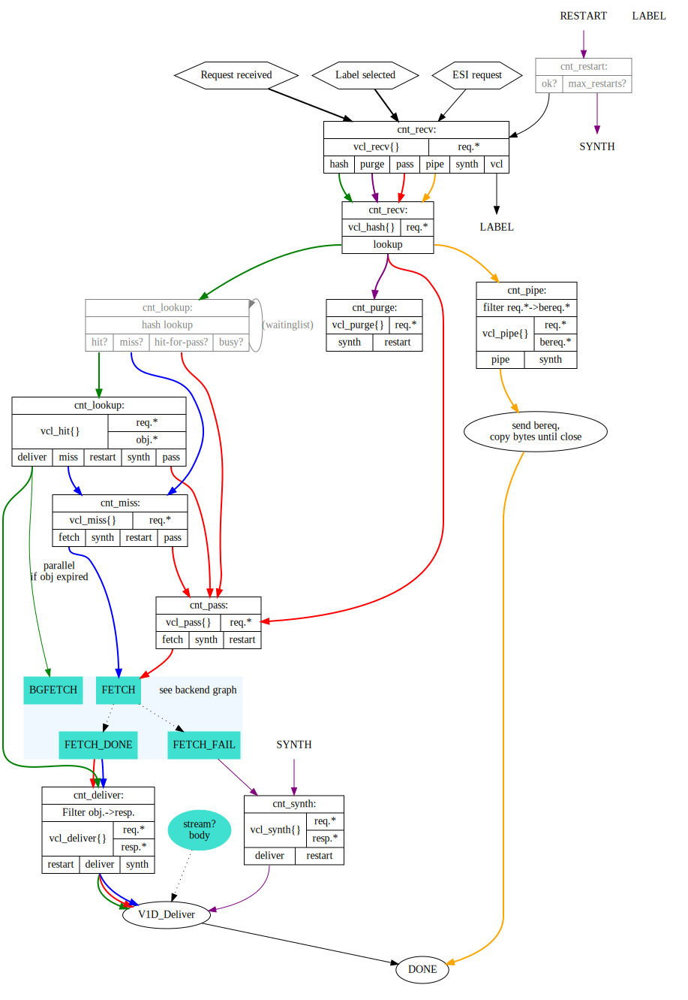

# varnish vcl generator

## Installation

```bash
$ npm install varnish-generator
```

## RUN

```bash
cd varnish-generator
node index.js -c ./examples/config.json -t ./examples/default.vcl
```

## API

```js
const varnishConfig = require('./config.json');
const varnishGenerator = require('varnish-generator');
varnishGenerator.getVcl(varnishConfig).then((vcl) => {
	console.info(vcl);
}).catch((err) => {
	console.error(err);
});
```
### varnishConfig

- `director` director选择backend的方式，默认为 `round_robin`

- `stale` 当varnish缓存过期之后多长时间还可用于返回，默认是`3s`

- `keep` 缓存过期之后，数据在过期多长时间可用于 If-Modified-Since / If-None-Match，默认是`10s`

- `backends` Array [{"name": "backendname", "prefix": "url prefix", "ip": "应用IP", "port": "应用端口"}]


```json
{
  "stale": "2s",
  "keep": "5s",
  "director": "round_robin",
  "backends": [
    {
      "name": "timtam",
      "prefix": "/timtam",
      "ip": "127.0.0.1",
      "port": 3000
    },
    {
      "name": "timtam",
      "prefix": "/timtam",
      "ip": "127.0.0.1",
      "port": 3010
    },
    {
      "name": "albi",
      "host": "white",
      "prefix": "/albi",
      "ip": "127.0.0.1",
      "port": 3020
    },
    {
      "name": "albi",
      "host": "white",
      "prefix": "/albi",
      "ip": "127.0.0.1",
      "port": 3030
    },
    {
      "name": "default-backend",
      "ip": "127.0.0.1",
      "port": 8000
    }
  ],
  "name": "varnish-test",
  "version": "2016-01-27",
  "updatedAt": ["2016-01-27"]
}
```

## varnish 的缓存生成



首先先来看一下`varnish`源代码中对于Cache TTL的生成，以及几个默认的配置值

- `default_grace` 10.000s

- `default_keep` 0.000s

- `default_ttl` 120.000s

### RFC2616_Ttl

[View the code](RFC2616_Ttl.md)

- status: 302、307 如果有设置`Cache-Control`或者`Expires`，则解析该字段做为缓存时效，或者为`-1`

- status: 202、203、204、300、301、304、404、410、414 如果有设置`Cache-Control`或者`Expires`，则解析该字段做为缓存时效，否则为`default ttl`

- 其它的缓存都设置为不缓存`-1`

### Cache Grace

- 使用配置的默认 grace

- 如果`Response`返回的`Cache-Control`有设置stale-while-revalidate，则使用该值


而我自己在使用`varnish`的实践中，发现有些时间客户没有控制好缓存的配置，因此我是选择设置`default_ttl`为0，Cache TTL 由backend返回的Cache-Control控制。我自己使用的`varnish`配置，主要通过以下的情况

### vcl_recv

- SPDY or HTTP/2.0 `synth(405)`

- method isn't GET HEAD PUT POST TRACE OPTIONS DELETE  `pipe`

- websocket `pipe`

- method isn't GET HEAD `pass`

- Authorization  `pass`

- request url "\?cache=false" or "&cache=false" or Cache-Control == "no-cache"  `pass`


注：如果是GET请求，发送方如果能确定该请求是不可以缓存的，尽量使用设置Request Cache-Control header 的方式

### vcl_backend_response

- ttl 小于0 设置该请求为不可缓存，ttl为120s，`deliver`

- response header Set-Cookie 不为空，设置该请求为不可缓存，ttl为120s，`deliver`

- response header Surrogate-Control ~ "no-store" ，设置该请求为不可缓存，ttl为120s，`deliver`

- response header Surrogate-Control 为空，而且 Cache-Control ~ "no-cache|no-store|private" ，设置该请求为不可缓存，ttl为120s，`deliver`

- response header Vary == '*'，设置该请求为不可缓存，ttl为120s，`deliver`

- 其它的情况(ttl由s-maxage or max-age等生成) `deliver`


## Test


根据配置好的`default.vcl`，启动`varnishd`，以及启动测试 server

```bash
varnishd -f ~/github/varnish-generator/examples/default.vcl -a :8001 -p default_ttl=0 -p default_grace=60 -F

node test/support/server
```

### 不可缓存的请求

- POST/PUT等请求 `vcl_recv` --> `vcl_hash` --> `vcl_pass` --> `vcl_backend_fetch` --> `vcl_response` --> `vcl_deliver`

- 请求关中Cache-Control:no-cache或者url中query参数带有cache=false `vcl_recv` --> `vcl_hash` --> `vcl_pass` --> `vcl_backend_fetch` --> `vcl_response` --> `vcl_deliver`

- HTTP Status 不属于 202、203、204、300、301、302、304、307、404、410、414，响应头设置Cache-Control也无用 `vcl_recv` --> `vcl_hash` --> `vcl_miss` --> `vcl_backend_fetch` --> `vcl_response` --> `vcl_deliver`

- Set-Cookie、max-age=0 等由服务器端返回的数据导致不能缓存的，`vcl_recv` --> `vcl_hash` --> `vcl_miss` --> `vcl_backend_fetch` --> `vcl_response` --> `vcl_deliver`

### 可缓存的GET/HEAD请求

GET /cache/max-age/60 返回数据设置Cache-Control:public, max-age=60

- 无缓存，数据从backend中拉取 `vcl_recv` --> `vcl_hash` --> `vcl_miss` --> `vcl_backend_fetch` --> `vcl_response` --> `vcl_deliver`

- 有缓存且未过期，从缓存中返回，X-Hits + 1  `vcl_recv` --> `vcl_hash` --> `vcl_hit` --> `vcl_deliver`

- 有缓存且已过期，backend正常，过期时间未超过stale(3s)，从缓存中返回，且从backend中拉取数据更新缓存  `vcl_recv` --> `vcl_hash` --> `vcl_hit` --> `vcl_deliver` --> `vcl_backend_fetch` --> `vcl_response`

- 有缓存且已过期(也超过stale)，backend正常，从backend中拉取数据更新缓存 `vcl_recv` --> `vcl_hash` --> `vcl_miss` --> `vcl_backend_fetch` --> `vcl_response` --> `vcl_deliver`

- 有缓存且已过期，backend挂起，过期时间未超过grace(60s)，从缓存中返回 `vcl_recv` --> `vcl_hash` --> `vcl_hit` --> `vcl_deliver` --> `vcl_backend_fetch`

- 有缓存且已过期，backend挂起，过期时间超过grace(60s)，Backend fetch failed `vcl_recv` --> `vcl_hash` --> `vcl_miss` --> `vcl_backend_fetch` --> `vcl_deliver`


## License

MIT